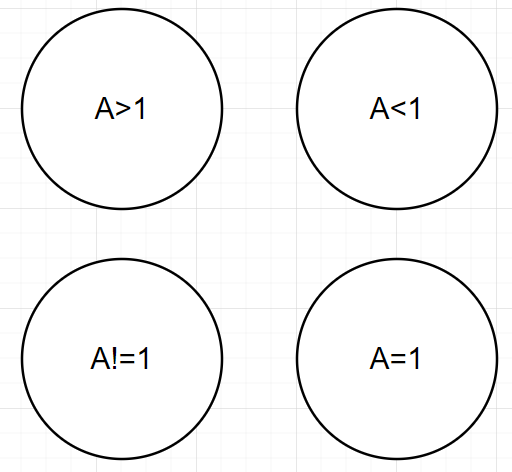

# Technische Dokumentation

in diesem Teil Dokumentieren wir die einzelnen Funktion des **RuleNetworkCreator** näher beschrieben.

## Form Drawio

Es wird die folgende form in Drawio verwendet .

Diese bestehen aus einer Logischen bedingun im innern die **Wahr** oder **Falsch** seien kann und einer Form. Die **Formen** haben die folgenden bedeutung : 

* Der Halbkreis steht für ein logisches **Und** , das heißt alle Verbindungen werden gesammelt und die bedingung gilt wenn alle wahr sind
* Der Kreis stellt einfach eine Logischebedingung dar
* Der **Halbmond** is ein logisches **Oder**
* Die **Liste** oben rechts sammelt einfach alle **Variablen** die in dem **Regelwerk** verwendung finden.
### Syntax Variablen
Die **Variablen** haben den folgende Syntax

**Abweichungen von diesem **Syntax** führen zu einer Fehlermeldung**
## Logische Verbindung
In dem folgendem Diagramm wird die Verbindung dargestellt.

Betrachtet man den **Pfeil** als **Source** und **Target**, so ist gilt die folgende Interpretation

**if (Source) then (Target)**
## Der Aufruf über die Konsole
Der folgende Befehl ruft das Programm **RuleNetworkCreator
** über die Konsole auf

	RuleNetworkCreator.py[Name Drawio File] [Name Diagramm]
