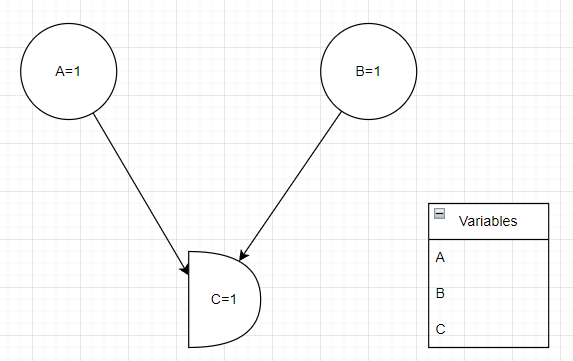

# RegelNetzwerk
In diesem Projekt stellen wir einen **Code generator** vor, der aus einem **Drawio**
Diagramm ein **Regelbasiertes Expertensystem** macht.

## Inhaltsverzeichniss:
* Quickstart
* Funktions Dokumentation
* Beispiele
## Quickstart
Wir beginnen mit dem Folgenden **Diagramm**

Die **Kreise** und der **Halb Kreis** sind Variablen. Die **Pfeile** stellen eine Logischeverbindung dar.
Das Element **"Variablen"** Listet alle variablen auf die in dem **Diagramm** verwendung finden.

Der folgende Konsolen Befehl

	RuleNetworkCreator.py TestRule-drawio QuickAnd
Wandel das Diagramm in das folgende **Skript** um **[QuickAnd.py](Doc/QuickAnd.py)**

	if (A==1) and (B==1) : (C==1)
